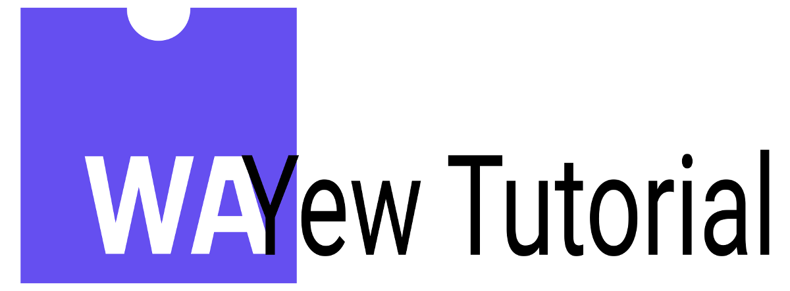

# YEW Megatutorial



Yes, I'm humbling joining the fight to widespread [Rust](https://www.rust-lang.org/), with a tutorial on [Yew](https://yew.rs).

You can see the parts of this series here, accessible trhough the Wiki:

- [Tut 01](https://github.com/davidedelpapa/yew-tutorial/wiki/Tut-01) - Introduction
- [Tut 02](https://github.com/davidedelpapa/yew-tutorial/wiki/Tut-02) - Extending the example
- [Tut 03](https://github.com/davidedelpapa/yew-tutorial/wiki/Tut-03) - Services and all
- [Tut 04](https://github.com/davidedelpapa/yew-tutorial/wiki/Tut-04) - ...and services for all

## Installation

This tutorial _pre-se_ does require at least some Rust knowledge.
However, I hope it would be profitable also for the beginners. I myself am still learning the language, yet in order to enjoy the full potential of Rust as applied to `WASM` technology one does not need to know all the intricacies of the type system.
A sufficient Rust knowledge is gained after few weeks of acquaintance with this language, thus I think that once the basics are learned, this guide can be very profitable also to the novices.

Of course, [Rust](https://www.rust-lang.org/tools/install) itself must be installed. Next, we need to install [wasm-pack](https://rustwasm.github.io/wasm-pack/). NOTE: I made this tutorial in a highly opinonated manner, not "just because", but just because the novices would not get lost around the many choices available.

```sh
cargo install wasm-pack
```

After this we'll need a JS bundler, and we'll use [rollup](https://rollupjs.org).

```sh
npm install --global rollup
```

#### After these you are good to go with the [tutorial part 1](https://github.com/davidedelpapa/yew-tutorial/wiki/Tut-01).
