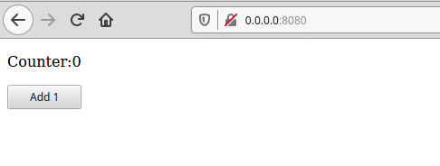

# YEW Megatutorial


Yes, I'm humbling joining the fight to widespread [Rust](https://www.rust-lang.org/), with a tutorial on [Yew](https://yew.rs).

You can see the parts of this series here:

- Tut 01 - This article
- [Tut 02](https://github.com/davidedelpapa/yew-tutorial/wiki/Tut-02) - Extending the example

## Part 1: Prerequisites, AKA, installation first

This tutorial _pre-se_ does require at least some Rust knowledge.
However, I hope it would be profitable also for the beginners. I myself am still learning the language, yet in order to enjoy the full potential of Rust as applied to `WASM` technology one does not need to know all the intricacies of the type system.
A sufficient Rust knowledge is gained after few weeks of acquaintance with this language, thus I think that once the basics are learned, this guide can be very profitable also to the novices.

Of course, [Rust](https://www.rust-lang.org/tools/install) itself must be installed. Next, we need to install [wasm-pack](https://rustwasm.github.io/wasm-pack/). NOTE: I made this tutorial in a highly opinonated manner, not "just because", but just because the novices would not get lost around the many choices available.

```sh
cargo install wasm-pack
```

After this we'll need a JS bundler, and we'll use [rollup](https://rollupjs.org).

```sh
npm install --global rollup
```

Now with thsese tools under our belt, let's move one to build soemthing.

## Part 2: Let's create our first app from scratch

From our project's folder let's create a new rust project

```sh
cargo new yew-tutorial --lib
```

It's important that it be a `lib`

```sh
cd yew-tutorial
code .
```

I'm using [code](https://code.visualstudio.com/) to develop, but you can use whichever IDE or plain text editor you like.
I myself many times use [gedit](https://wiki.gnome.org/Apps/Gedit), that simple!

Let's get over all files needed for this project, creating those missing as we go

### cargo.toml

In _cargo.toml_ let's add the following lines to the `[dependencies]`section

```toml
wasm-bindgen = "^0.2"
yew = "0.12"
```

We need to add as well a new `[lib]` section,
with the following:

```toml
[lib]
crate-type = ["cdylib"]
```

The file content should look like the following:

```toml
[package]
name = "yew-tutorial"
version = "0.1.0"
authors = ["you"]
edition = "2018"

[lib]
crate-type = ["cdylib"]

[dependencies]
wasm-bindgen = "^0.2"
yew = "0.12"
```

### index.html

Let's add a barebones _index.html_ in order to serve as the server's starting point:

```html
<!DOCTYPE html>
<html lang="en">
  <head>
    <title>Yew Tutorial</title>

    <meta charset="utf-8" />
    <script src="/pkg/bundle.js" defer></script>
  </head>

  <body></body>
</html>
```

The script we are refencing to, _bundle.js_, will be available in the _pkg/_ folder once the Rust lib is compiled. More on that later on.

We have left the `<body>` tag empty, because we'll nest there our Yew code

Now let's move on to change the files inside the _scr_ folder!

### scr/lib.rs

For each new `lib` project, cargo creates a _lib.rs_ with a `#[cfg(test)]` section for testing.
It is very useful, but for now we'll get rid of it. In its place we'll put the following:

```rust
mod app;
use wasm_bindgen::prelude::*;

#[wasm_bindgen]
pub fn run_app() -> Result<(), JsValue> {
    yew::start_app::<app::App>();

    Ok(())
}
```

Let's explain it step-by-step:

- we start defining the module _app_, which we'll create later on (file _app.rs_)
- we use the `wasm_bindgen::prelude::*` in order to make use of the `yew::start_app`
- the entrypoint for the `WASM` must be annotated, with a `#[wasm_bindgen]` annotation. We will refer to it in the _main.js_ file we will create, and available to us upon bundling. More on that later.
- as the _run_app()_ can return a **JsValue** wrapped in an Option, we need to specify it as the function return type, and also to return `Ok(())`

Lets create our _app_ mod next.

### scr/app.rs

As we defind a **mod** called _app_, we need to create a _app.rs_ file. Note: it is customary in the fullstack web world to call the main entry point of all web apps simply _app_. We as opinionated writers, will not renounce to this opinion!

Let's start our _app_ by using the usual `yew::prelude::*`

```rust
use yew::prelude::*;
```

As customary in Rust, yew uses structs and enums to handle data related logic.

We will need one struct for handling the app, and an enum to control the messages sent to the app.

First of all, let's write down the struct _App_ that we will implement, with the a custom state for this app.

```rust
pub struct App {
    counter: i64,
    link: ComponentLink<Self>,
}
```

As we can see the state is mantained by _counter_, while _link_ is a _ComponentLink_ which will contain the link to refer back to the current page invoking it. More on that later.

Now we'll write the enum _Msg_ to implement the "form" logic, or controller logic, of the app.

```rust
pub enum Msg {
    AddOne,
}
```

Let's understand the logic behind the simple example we'll use (taken from [yew's docs](https://docs.rs/yew/0.14.2/yew/) home page).

The app we will create will present a counter and a button to increase it:
the button is like a form, in that it will link back to the page sending a message, contained in the _Msg_ enum. Since the message is simple enough it, is sufficient we'll send the enum with the appropriate message, in this case it is present only the message to "add one to the counter", i.e., _AddOne_.

When the app will receive the message it will increment by one its counter, that is, the _counter_ state of the _App_ struct. after this, it will render the change.

It seems all complicated, but it is easier in code than explaining it.

Without further ado, we'll implement the _App_ struct:

```rust
impl Component for App {
    type Message = Msg;
    type Properties = ();
```

We implement Yew's _Component_ for our struct _App_.
In Yew each component has got a _Message_, used to comunicate with it, and a set of _Properties_.
For now we'll assign the enum _Msg_ to be the type for _Message_.

Each component has three fucntions: `create`, `update`, and `view`.

#### fn create

`create` is the equivalent of a **constructor** for the _component_.

We'll use the return-type `Self` which basically means we have to return a _App_ struct, that is the struct we are implementing.

```rust
    fn create(_: Self::Properties, link: ComponentLink<Self>) -> Self {
        App {
          link,
          counter: 0
        }
    }
```

We start with the `counter` set to zero.

It is good to notice that `create()` will get a _Properties_, which we will not use, hence the undersocre, and a _ComponentLink_ to refer to itself, which we will store in the _App_ struct we are returning.

#### fn update

`udate` determines the logic needed in order to handle events.

The update return type is _ShouldRender_ which is a bool indicating if after the logic processing is done the component should render itself again or not. Returning a _true_ or _false_ is sufficient.

```rust
    fn update(&mut self, msg: Self::Message) -> ShouldRender {
        match msg {
            Msg::AddOne => self.counter += 1,
        }
        true
    }
```

We match over the Message we receive (that is the only type it will receive), and establish that if the message is \_AddOne, then it must add 1 to the internal counter.

At the end we return a _true_ menaing that we vant to re-render the component

#### fn view

Finally we will "see" what our component looks like!
`view` is incharged of (re-)rendering our component in the DOM.

We can return various types, in this case it is a _Html_ object.

```rust
    fn view(&self) -> Html {
        html! {
            <div>
            <p> {"Counter: "} { self.counter }</p>
                <button onclick=self.link.callback(|_| Msg::AddOne)>{ "Add 1" }</button>
            </div>
        }
    }
```

Notice first of all that the view relies only on its internal state: messages should be left where messages belong, that is, the updating logic. This is so, in order to separate the component's representation from its logic.

We'll use the `html!` powerful macro in order to render components in a quasi-html style.
The rationale behind it is the same as using _JSX_ in _React_: inserting elements of HTML inside a language (Rust in this case), using a kind of DSL (Domain Specific Language).
Thus, we've used `<div>`, `<button>`, and `<p>` inside a Rust macro.

Some rules we can see:

- the value of a Rust expression must be inserted inside brackets `{}`
- text must be inserted as strings, so it is an expression, thus it belongs inside brackets as well
- we have `self` to refer to the _App_'s state.

One thing of interest: using the link to the component we activate a callback for the `<button>`'s _onclink_, to which we pass the message `AddOne`

Our _app.rs_ is done!

### main.js

In the root directory, let's create a _main.js_ file, which will be the starting point for our wasm-js integration

```javascript
import init, { run_app } from "./pkg/yew_tutorial.js";
async function main() {
  await init("/pkg/yew_tutorial_bg.wasm");
  run_app();
}
main();
```

We are calling here the _.js_ and _.wasm_ files that will be created in the directory **pkg/** upon compilation. Convention wants that the names that we put in Rust, which are separated with dashes, become separated with undersocores in javascript. Thus our _yew-tutorial_ becomes _yew_tutorial_.

The _run_app()_ function will be available because it is exported from the _lib.rs_

### Build and Run

It is now time to build and to run our first example

```sh
wasm-pack build --target web
```

The first build is usually longer than the following.

At the end of this we sould be greeted by a:

```
[INFO]: :-) Your wasm pkg is ready to publish at ./pkg.
```

If we check out the content we'll see the _.js_ and _.wasm_ files almost ready to be served.

Almost, because we need to bundle them first. We'll use the _rollup_ tool we installed at the begnning

```sh
rollup ./main.js --format iife --file ./pkg/bundle.js
```

Let's serve it with our handy python _http.server_ module.
Remember, `ctrl-c` in order to shut it down:

```sh
python -m http.server 8080
```

Now let's head our browser to _http://0.0.0.0:8080/_

We can see the value starting from 0 and a button to add to that value.



Mission accomplished!
